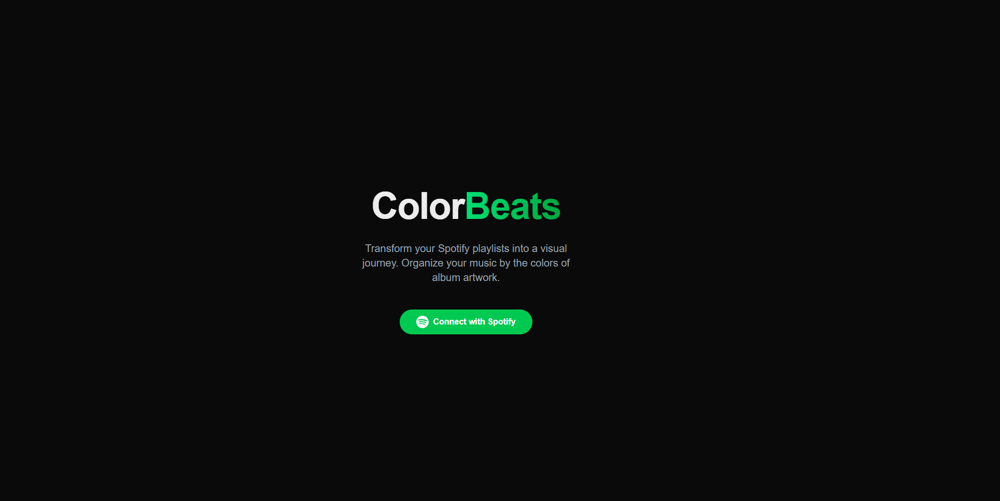

# ColorBeats



**Transform your Spotify playlists into a visual journey. Organize your music by the colors of album artwork.**

ColorBeats is a Next.js web application that connects to your Spotify account, analyzes the dominant colors in your playlist's album artwork, and allows you to reorganize your playlists based on these colors. Create beautiful rainbow-ordered playlists and discover your music in a whole new way!

## ✨ Features

- 🎨 **Color Analysis**: Automatically extracts dominant colors from album artwork
- 🌈 **Rainbow Sorting**: Organizes tracks by color to create visually pleasing playlists
- 🔄 **Smart Backup**: Automatically backs up your original playlist order
- 📱 **Responsive Design**: Works beautifully on desktop and mobile devices
- 🎵 **Spotify Integration**: Seamlessly connects with your Spotify account
- ⚡ **Fast Processing**: Efficient color extraction and playlist reordering
- 🎯 **Multiple Sort Options**: Sort by color, date, or track count

## 🚀 Demo

Visit the live demo: [https://colorbeats.matsdh.nl](https://colorbeats.vercel.app)

## 🛠️ Tech Stack

- **Framework**: [Next.js 15](https://nextjs.org/) with App Router
- **Language**: TypeScript
- **Styling**: [Tailwind CSS](https://tailwindcss.com/)
- **Animations**: [Framer Motion](https://www.framer.com/motion/)
- **Color Analysis**: [node-vibrant](https://github.com/Vibrant-Colors/node-vibrant)
- **Spotify API**: [@spotify/web-api-ts-sdk](https://github.com/spotify/spotify-web-api-ts-sdk)

## 🏃‍♂️ Quick Start

### Prerequisites

- Node.js 18+ and npm
- A Spotify Developer Account

### 1. Clone the Repository

```bash
git clone https://github.com/yourusername/colorbeats.git
cd colorbeats
```

### 2. Install Dependencies

```bash
npm install
```

### 3. Set Up Spotify App

1. Go to the [Spotify Developer Dashboard](https://developer.spotify.com/dashboard)
2. Create a new app
3. Add your redirect URI (e.g., `http://localhost:3000` for development)
4. Note your Client ID

### 4. Configure Environment

Create a `.env.local` file in the root directory:

```env
NEXT_PUBLIC_SPOTIFY_CLIENT_ID=your_spotify_client_id_here
```

### 5. Update Redirect URI

In `src/lib/spotify.ts`, update the `REDIRECT_URI` constant:

```typescript
const REDIRECT_URI = 'http://localhost:3000'; // For development
```

### 6. Run the Development Server

```bash
npm run dev
```

Open [http://localhost:3000](http://localhost:3000) to see the application.

## 📁 Project Structure

```
src/
├── app/                    # Next.js App Router
│   ├── globals.css        # Global styles
│   ├── layout.tsx         # Root layout
│   └── page.tsx           # Home page
├── components/            # React components
│   ├── Navbar.tsx         # Navigation bar
│   ├── PlaylistGrid.tsx   # Main playlist grid
│   └── PlaylistModal.tsx  # Playlist detail modal
└── lib/                   # Utility libraries
    ├── colorExtractor.ts  # Color analysis functions
    ├── colors.ts          # Color manipulation utilities
    └── spotify.ts         # Spotify API integration
```

## 🔧 Configuration

### Spotify API Scopes

The application requests the following Spotify permissions:

- `playlist-read-private` - Read private playlists
- `playlist-modify-public` - Modify public playlists
- `playlist-modify-private` - Modify private playlists
- `user-library-read` - Read user's library

### Rate Limiting

The app implements intelligent rate limiting to respect Spotify's API limits:

- Maximum 3 requests per 2-second window
- Automatic request queuing
- Graceful error handling and retries

## 🤝 Contributing

We welcome contributions! Please follow these guidelines:

### Getting Started

1. Fork the repository
2. Create a feature branch: `git checkout -b feature/amazing-feature`
3. Make your changes
4. Commit your changes: `git commit -m 'Add amazing feature'`
5. Push to the branch: `git push origin feature/amazing-feature`
6. Open a Pull Request

### Development Guidelines

- **Code Style**: We use Prettier and ESLint. Run `npm run lint` before committing
- **TypeScript**: Maintain strict type safety
- **Components**: Keep components small and focused
- **Testing**: Add tests for new features (we welcome help setting up a testing framework!)

### Areas for Contribution

- 🧪 **Testing**: Help set up Jest/Testing Library
- 🎨 **UI/UX**: Improve the design and user experience
- 🔊 **Audio Features**: Add music preview capabilities
- 📊 **Analytics**: Track color distribution and statistics
- 🌐 **Internationalization**: Add multi-language support
- ♿ **Accessibility**: Improve accessibility features
- 📱 **Mobile**: Enhance mobile experience
- ⚡ **Performance**: Optimize color extraction algorithms

### Code of Conduct

- Be respectful and inclusive
- Provide constructive feedback
- Help others learn and grow
- Follow the existing code patterns

## 📝 Environment Variables

| Variable | Description | Required |
|----------|-------------|----------|
| `NEXT_PUBLIC_SPOTIFY_CLIENT_ID` | Your Spotify app's Client ID | Yes |

## 🚀 Deployment

### Vercel (Recommended)

1. Push your code to GitHub
2. Connect your repository to [Vercel](https://vercel.com)
3. Add your environment variables in the Vercel dashboard
4. Update the `REDIRECT_URI` in `src/lib/spotify.ts` to your production URL
5. Deploy!

### Other Platforms

The app can be deployed to any platform that supports Next.js:

- Netlify
- Railway
- DigitalOcean App Platform
- AWS Amplify

## 🐛 Known Issues

- Color extraction may be slower for large playlists (we're working on optimization)
- Some album artwork may not have sufficient color contrast for sorting
- Spotify's rate limits may cause delays with very large playlists

## 📄 License

This project is licensed under the MIT License - see the [LICENSE](LICENSE) file for details.

## 🙏 Acknowledgments

- [Spotify Web API](https://developer.spotify.com/documentation/web-api/) for the music data
- [node-vibrant](https://github.com/Vibrant-Colors/node-vibrant) for color extraction
- [Next.js](https://nextjs.org/) team for the amazing framework
- All contributors who help make this project better!

## 📞 Support

- 🐛 [Report a Bug](https://github.com/yourusername/colorbeats/issues/new?labels=bug)
- 💡 [Request a Feature](https://github.com/yourusername/colorbeats/issues/new?labels=enhancement)
- 💬 [Discussions](https://github.com/yourusername/colorbeats/discussions)

---

Made with ❤️ and 🎵 by the ColorBeats community
